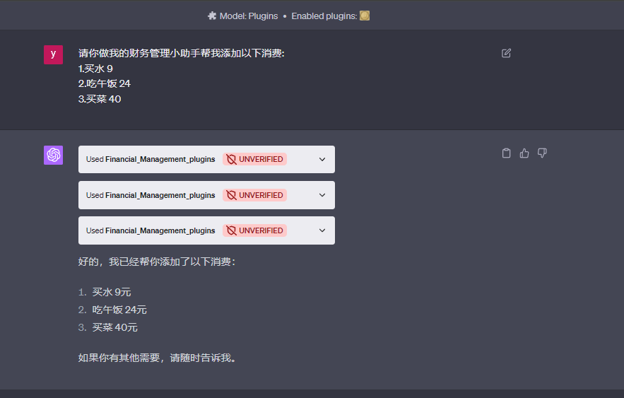
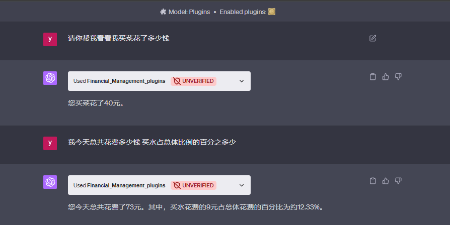

# plugins_Financial_Management

# Chat-GPT 4.0 插件 财务管理小助手 

预计包含的功能:

* 实时记账
* 导出建议
* 图表输出

## 效果展示

* 添加功能
</img>

* 展示和计算功能(注意是完全不同的两个会话)
</img>

## ChatGPT插件制作教程

1.mkdir .well-known 
创建插件清单文件 (可以理解成你这个插件的身份证)

2.创建 openai.yaml 

3.写main.py 并运行